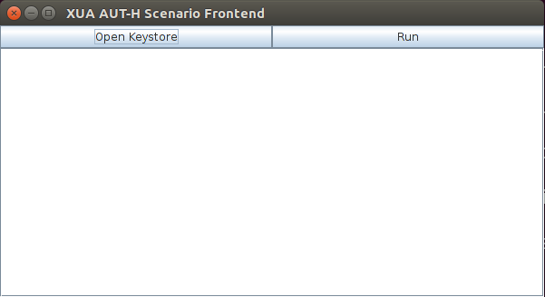
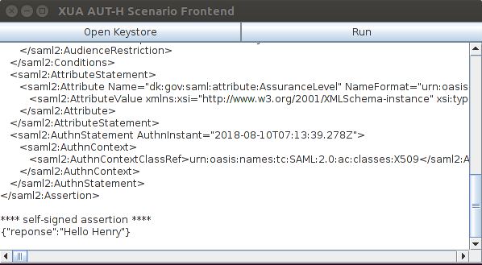
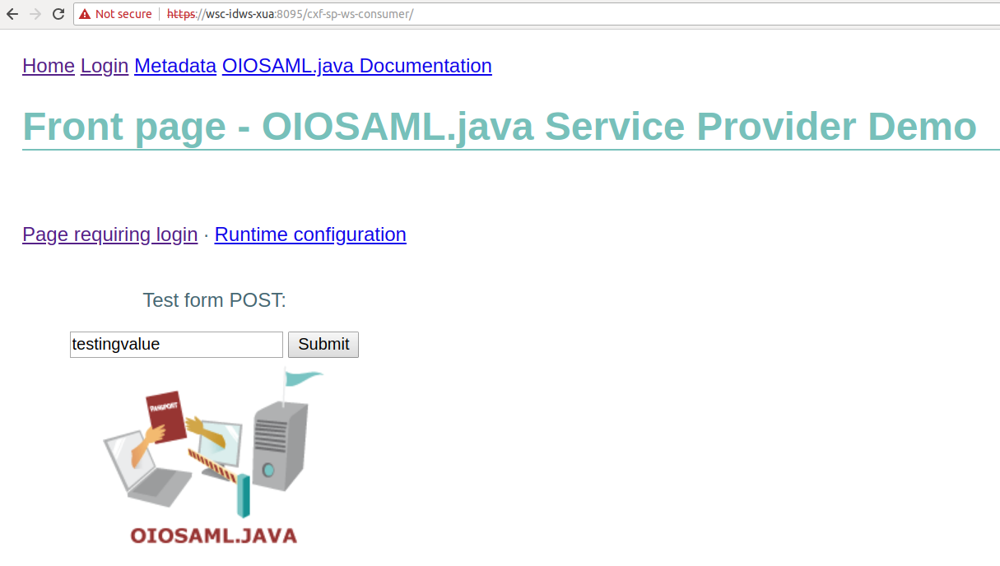
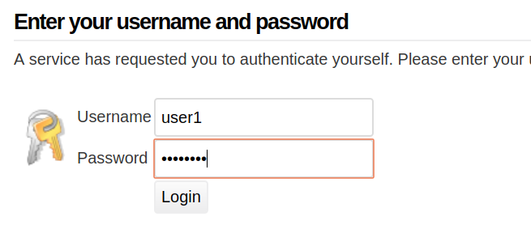
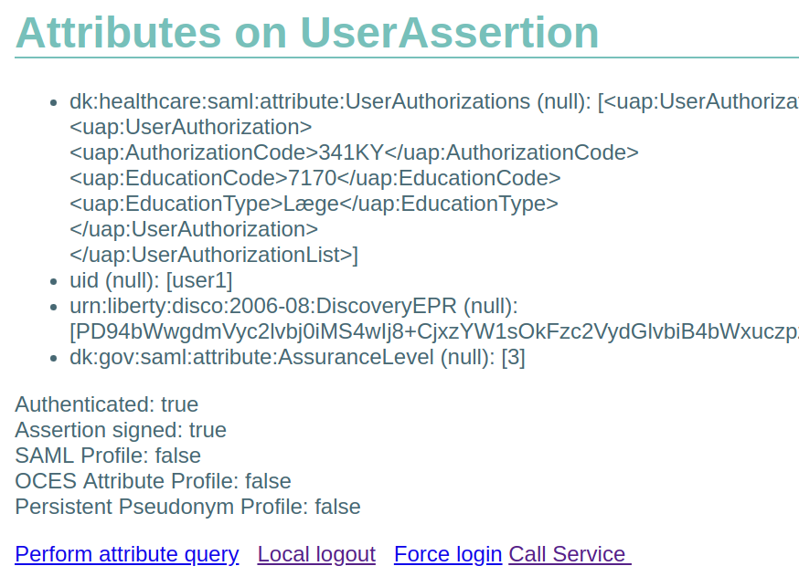
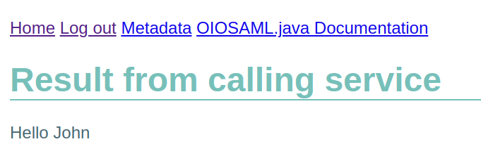

Java Reference Code for

OIO IDWS XUA Profile

Status: Version 1.2

Version: 17.07.2018

[1 Introduction [4](#introduction)](#introduction)

[1.1 Intended audience [4](#intended-audience)](#intended-audience)

[1.2 Prerequisites [4](#prerequisites)](#prerequisites)

[1.3 Apache CXF Version [4](#apache-cxf-version)](#apache-cxf-version)

[1.4 Disclaimer [4](#disclaimer)](#disclaimer)

[2 Support Components [5](#support-components)](#support-components)

[2.1 Installing Docker [5](#installing-docker)](#installing-docker)

[2.2 Running Docker Images [5](#running-docker-images)](#running-docker-images)

[2.3 The IdP Component [6](#the-idp-component)](#the-idp-component)

[2.3.1 Login credentials [6](#login-credentials)](#login-credentials)

[2.4 The STS Component [7](#the-sts-component)](#the-sts-component)

[2.5 Using the STS Component [7](#using-the-sts-component)](#using-the-sts-component)

[2.5.1 Run locally [7](#run-locally)](#run-locally)

[2.5.2 Known limitations [8](#known-limitations)](#known-limitations)

[3 The SAML-H framework [9](#the-saml-h-framework)](#the-saml-h-framework)

[3.1 Using the framework [9](#using-the-framework)](#using-the-framework)

[3.2 Example code [10](#example-code)](#example-code)

[4 The Scenarios [11](#the-scenarios)](#the-scenarios)

[4.1 The Web Service Providers [11](#the-web-service-providers)](#the-web-service-providers)

[4.1.1 Web Service Provider (Bearer Token) [11](#web-service-provider-bearer-token-without-signature)](#web-service-provider-bearer-token-without-signature)

[4.1.2 Web Service Provider (Bearer Token with Signature) [12](#web-service-provider-bearer-token-with-signature)](#web-service-provider-bearer-token-with-signature)

[4.1.3 Web Service Provider (Holder-of-key tokens) [12](#web-service-provider-holder-of-key-tokens)](#web-service-provider-holder-of-key-tokens)

[4.2 System User Scenario (Bearer Token) [12](#system-user-scenarios-general-info)](#system-user-scenarios-general-info)

[4.3 System User Scenario (Bearer Token with Signature) [13](#system-user-scenario-bearer-token-with-signature)](#system-user-scenario-bearer-token-with-signature)

[4.4 System User Scenario (Holder-of-key Token) [13](#system-user-scenario-holder-of-key-token)](#system-user-scenario-holder-of-key-token)

[4.4.1 Notes regarding token caching [14](#notes-regarding-token-caching)](#notes-regarding-token-caching)

[4.5 Aut-H Scenario [14](#aut-h-scenario)](#aut-h-scenario)

[4.6 Bootstrap Scenario [16](#section)](#section)

[4.7 STS Test Scenario [19](#sts-test-scenario)](#sts-test-scenario)

[4.7.1 The test-cases [19](#the-test-cases)](#the-test-cases)

[5 Example payloads [20](#example-payloads)](#example-payloads)

[5.1 WSC-TO-STS [20](#wsc-to-sts)](#wsc-to-sts)

[5.2 STS-TO-WSC [20](#sts-to-wsc)](#sts-to-wsc)

[5.3 WSC-TO-WSP [20](#wsc-to-wsp)](#wsc-to-wsp)

[5.4 WSP-TO-WSC [20](#wsp-to-wsc)](#wsp-to-wsc)

[6 References [21](#references)](#references)

**Changelog**

17-07-2018 Initial release

# Introduction

This document is a companion to the Java reference source code that showcases how to use the Apache CXF framework to implement solutions adhering to the \[IDWS XUA\] Common Web Service Profile currently under development by the Danish Health Data Authority.

As part of the \[IDWS XUA\] documentation the different scenarios that are shown in this reference code will be described in detail.

The Apache CXF specific configuration is covered in \[CXF\], and it is recommended to read that document first.

This document will refer to the reference code a lot, so it is also recommended to have the reference code available while reading this document.

## Intended audience

This document is written for developers, and while all configuration and customization of Apache CXF concerning security is dealt with, some experience with Apache CXF or a similar web service framework is recommended. The reader is also expected to have experience with Java development in general.

As OIO IDWS XUA is based on OIO IDWS, it is highly recommended to read the OIO IDWS documentation in this folder as well as the document that covers CXF and WS-SecurityPolicy.

## Prerequisites

The source code uses Apache Maven 3 \[MAVEN\] as a build tool, and the source code requires at least Java 7 with Strong Crypto \[CRYPTO\] to compile and run. The reader is expected to have these tools available before using the reference source code. Maven handles all other dependencies.

## Apache CXF Version

The reference code is based on Apache CXF 3.2.6, except for the bootstrap scenario, which uses CXF 3.0.16 – this is due to an incompatibility between CXF 3.2.x and OIOSAML. CXF 3.2.x uses OpenSAML 3.3, where OIOSAML uses OpenSAML 2.6, and they cannot co-exist.

## Disclaimer

The Danish Agency for Digitisation and the Danish Health Data Authority provide the reference code as is and assume no responsibility for the code. Service Providers should understand the limitations of the code and deal with these according to their own needs.

# Support Components

The OIO IDWS XUA reference code comes with trust pre-established to two identity providers, a SAML 2.0 Identity Provider and a Security Token Service.

These two identity provider components are part of the distribution and can be started using \[DOCKER\]. This chapter covers how to configure and run the two components, as they are required to run the OIO IDWS XUA reference code.

Please note that these support components are only needed when running the reference code, they are not needed in a production environment, where existing infrastructure will contain both a SAML 2.0 Identity Provider and a Security Token Service.

Also note that these support components should not be used in a production setting, as they are not secured or hardened in any meaningful way – they exist solely to show how to the reference code can interact with such components.

## Installing Docker

How to install and use Docker is somewhat outside the scope of this document, but for quick reference, this subchapter will outline the steps required to install and run Docker. For more details, please consult \[DOCKER\].

Docker can be installed on Linux, MacOS and Windows, though it should be noted, that the support components are packaged in Linux images, so during installation, make sure to enable Linux support if Docker is installed on a non-Linux machine.

1.  Start by getting the Docker installer from the Docker website. For instance, the Windows version is available here: <https://docs.docker.com/docker-for-windows/install/>

2.  After installing the Docker software, install the orchestration tool Docker Compose, which can be found here: <https://docs.docker.com/compose/install/>

After Docker and Docker Compose have been installed, and the Docker software has been launched, the machine is ready to run Docker images.

## Running Docker Images

Docker images are distributed through Docker Repositories, or can be built locally on the machine that runs the Docker images.

When running a Docker image, it is recommended to use some sort of orchestration tool to configure, start and stop images. One such tool is Docker Compose (others are available), and the support components are distributed together with a Docker Compose file that allows for starting and stopping the support components.

In the folder structure for the reference code, the scripts for building and running the Docker images are located here

/oioidws-xua-scenarios/docker

/oioidws-xua-scenarios/docker/idp

/oioidws-xua-scenarios/docker/sts

In the root folder, there is a simple Linux shell script (start.sh), and a corresponding Windows batch file (start.bat), for building and running both the Docker images – the steps performed by the script are the following

1.  Stop any running instances by calling “docker-compose down”

2.  Re-build the STS Docker image by running the compile-build-image.sh script in the sts folder

3.  Re-build the IdP Docker image by running the build-image.sh script in the idp folder

4.  Starting the two freshly build images by running “docker-compose up”

Note that the docker-compose up/down commands are running the docker-compose.yml file that resides in the root folder, which contains 3 images

- **mysql**. This container will start a MySQL instance, which is used by the STS image to store information about WSPs and WSCs

- **sts**. This container will start the Apache STS support component.

- **simple-idp**. This container will start the SimpleSAMLPhp IdP support component.

Looking more closely at the two build scripts located in the idp/sts subfolders, we see that they are also just simple scripts that run the docker command to build the image located in the subfolders (the script in the sts folder also re-compiles the STS source code, to ensure it is up to date).

### Notes regarding MySQL docker image

The docker-compose.yml file tries to mount a volume (a folder on the host-system for persistent storage), and MySQL uses this for storing the database content.

This volume must be writeable by the user account running the Docker service. On most Linux systems, the service is running with root privileges, ensuring write-access by default, but on systems (Windows and Mac) where the Docker service might not be running with root privileges, the user running the service must be granted full write access to the folder.

Persistent storage is not needed in most circumstances, so another solution for missing write access to the folder, is simply to delete these two lines from the docker-compose.yml file

volumes:

- ./db:/var/lib/mysql

## The IdP Component

The IdP component is based on the Open Source SAML framework SimpleSAMLPhp version 1.15.4.

As the IdP is used primarily to support the bootstrap token scenario, the modifications made to SimpleSAMLPhp revolve around issuing bootstrap tokens.

There are some basic certificate, SSL, port, etc configuration on Apache and SimpleSAMLPhp, but the main changes are in the following folders

**var-www-simplesamlphp/modules**

The modifications needed to issue a compliant token have been hardwired into the classes found in this folder.

**var-www-simplesamlphp/vendor**

A few hardwired modifications to make SimpleSAMLPhp use and require SHA-256 as the digest algorithm for signature computation.

### Login credentials

For test purposes, three users have been hardwired into the IdP component, these are

| **Username** | **Password** |
|--------------|--------------|
| user1        | Test1234     |
| user2        | Test1234     |
| user3        | Test1234     |

## The STS Component

The STS component is based on the Apache STS found in the CXF 3.2.4 distribution.

The CXF STS is not compliant with the OIO IDWS XUA specification, in the sense that it does not issue fully compliant tokens. To ensure that the tokens are fully compliant, a few modifications to the CXF source code have been added to the STS codebase.

These modifications can be found in the /src/main/java/org/ folder, whereas the actual STS extension- and configuration classes can be found in the /src/main/java/dk/ folder.

## Using the STS Component

The Docker scripts mentioned above can be used to compile and run the STS component, though both \[MAVEN\] and Java 8 are required to compile the component.

It is also possible to compile and run the component without the use of Docker, though a running MySQL instance is required in that case.

When running locally, make sure to modify the application.properties file found in /src/main/resources/ so the dataSource configuration points to the MySQL server.

The application.properties file contains some settings that can be modified to change the behaviour of the STS, these are

sts.debug = true/false

Set this value to “true” to enable trace logging on the STS – all SOAP request/responses will be logged on the STS if this is enabled.

sts.testheader = true/false

Set this value to “true” to enable test-mode on the STS. When enabled, the STS will inspect all incoming requests for a specific HTTP header, and depending on the value of this header, it will cause a specific error to occur – this is used by the reference code to show how different errors are handled by the WSP/WSC components.

### Run locally

To run the STS component outside of Docker, first ensure that a MySQL instance is running and available, and that the application.properties file is correctly updated. Then run the following maven comment from the command-line.

\$ mvn clean install spring-boot:run

This will recompile the STS code, and start the STS.

Once started, the STS listens on port 8181, and the GUI for managing WSPs and WSCs can be accessed in a web-browser at (the STS is pre-configured with the WSPs and WSCs needed to run all the scenarios in the reference code)

<https://localhost:8181/>

And the WS-Trust service endpoint for retrieving tokens can be accessed here

<https://localhost:8181/service/sts>

### Known limitations

Modifications made through the GUI do not take effect until the next application restart, as much of the configuration is read once during application startup.

# The SAML-H framework

The SAML-H Framework is a stand-alone library that can parse, generate and validate the following complex-valued SAML attributes that are used by the IDWS XUA specification

- **ChildrenInCustody** (dk:healthcare:saml:attribute:ChildrenInCustody)

- **OIO-BPP** (dk:gov:saml:attribute:Privileges_intermediate)

- **OnBehalfOf** (dk:healthcare:saml:attribute:OnBehalfOf)

- **ProviderIdentifier** (urn:ihe:iti:xua:2017:subject:provider-identifier)

- **PurposeOfUse** (urn:oasis:names:tc:xspa:1.0:subject:purposeofuse)

- **ResourceId** (urn:oasis:names:tc:xacml:2.0:resource:resource-id)

- **Role** (urn:oasis:names:tc:xacml:2.0:subject:role)

- **UserAuthorization** (dk:healthcare:saml:attribute:UserAuthorizations)

When implementing a WSP (or an identity provider or security token service) that either receives or issues tokens with these attributes, the SAML-H framework can be used to easily generate, parse and/or validate the attribute values.

## Using the framework

The framework does not have any dependencies besides Java 8, nor does it require any initialization before it can be used.

Each attribute is supported by a class with the following methods

- \<entity\>.validate() - This method throws a ValidationException if the entity in question is not valid.

- \<entity\>.parse() - This static method takes a raw attribute value as input, and generates an instance of the class

- \<entity\>.generate() - This method serializes the class instance into a raw attribute, usually as a String representation

For instance, working with the PurposeOfUse attribute, its attribute value is represented by an XML structure that looks like this

\<PurposeOfUse xmlns="urn:hl7-org:v3"

xmlns:xsi="http://www.w3.org/2001/XMLSchema-instance"

xsi:type="CE"

code="TREATMENT"

codeSystem="urn:oasis:names:tc:xspa:1.0"

/\>

Given a String that contains this XML structure, the SAML-H framework can convert this into an instance of the PurposeOfInstance class like this

String str = "\<above xml\>";

PurposeOfUse purposeOfUse = PurposeOfUse.parse(str, Validate.YES);

The resulting instance of the PurposeOfUse class can then be used to access the fields and attributes, as well as modify them. When using the parse() methods, the second argument can be used to make a call to the validate() method, without having to manually invoke it.

Note that depending on the type of attribute, the parse() method might be overloaded to take different kinds of input (String instances, DOM Element instances, etc).

For identity providers or security token services wishing to issue tokens with these attributes, the SAML-H framework supplies Builders for each of the attributes. If we look at the PurposeOfUse attribute again, it is possible to construct an instance like this

PurposeOfUse purposeOfUse = PurposeOfUse.builder()

.code(Code.TREATMENT)

.codeSystem("urn:oasis:names:tc:xspa:1.0")

.xsiType("CE")

.build();

Builders are available on all the attribute classes. It is recommended to run the validate() method on the resulting instance, to make sure it is valid, before issuing tokens with the attribute value.

## Example code

The SAML-H framework is used by the STS support component when issuing tokens, and it is used by the WSP reference implementations when parsing the incoming tokens.

Besides that, the test-cases in the SAML-H framework cover the various use-cases for each of the attributes.

# The Scenarios

All the scenarios require the various components are accessed through specific DNS names. As the scenarios will likely be executed on localhost, make sure to add the following entries to your hosts file (usually /etc/hosts on Linux machines, and c:\windows\system32\drivers\etc\hosts on Windows machines)

127.0.0.1 wsp-idws-xua

127.0.0.1 wsc-idws-xua

127.0.0.1 sts-idws-xua

127.0.0.1 idp-idws-xua

This will ensure that the various webservice calls, and websites are accessible when running the scenario reference code.

### Note for non-Linux Docker hosts

If any of the applications are running inside a Docker container, on non-Linux host, then the application cannot be accessed through 127.0.0.1, instead the Docker containers IP address must be used.

To find the Docker contains IP address, do the following

\$ docker ps

Locate the ID of the container in question

\$ docker inspect \<ID\>

Locate the IPAdress information in the output from this command.

## The Web Service Providers

To support the various scenarios, three different WSP implementations are available, and the differences between them are outlined in the subchapters below.

All WSPs perform the same operations on the incoming request, these are

- The class XuaSamlAssertionValidator performs validation on the incoming SAML token, and extracts OIO-BPP, UserAuthorization and ResourceID attributes from the token (using the SAML-H framework)

- The service implementation (HelloWorldPortTypeImpl) then inspects these attributes and prints them to the console

A real WSP would use these attribute values for authorization decisions.

Each of the scenarios in the reference code interacts with one of these WSPs. The documentation for each scenario will contain information about which WSP to use.

The WSPs can be started by running the following command in the command-line in the folder for the chosen WSP

\$ mvn clean install tomcat7:run-war

This will re-compile the WSP and start the application.

### Web Service Provider (Bearer Token without Signature)

This WSP accepts requests that contains an embedded bearer token issued by the STS.

The source for this WSP is in the folder /oioidws-xua-scenarios/service-bearer-nosign/.

This WSP differs from the others in how the WS-SecurityPolicy section of the WSDL is structured. Unlike the other WSPs, this one does not require a signature on the incoming request (but it will sign the response).

- The SAML token is configured as a \<SupportingToken\> element

- No InputPolicy is applied to the operations, but an OutputPolicy is.

This is the simplest of the use-cases, as it allows any WSC who has the bearer token to call the WSP, without any further proof-of-identity.

### Web Service Provider (Bearer Token with Signature)

This WSP accepts requests that contain an embedded bearer token issued by the STS, but it also requires the WSP to sign the request with a certificate trusted by the WSP.

There is no built-in correlation between the supplied token and the signature performed by the WSC, as the token does not contain any SubjectConfirmationData.

The source for this WSP is in the folder /oioidws-xua-scenarios/service-bearer/.

This WSP differs from the above bearer case in how the WS-SecurityPolicy section of the WSDL is structured.

- The SAML token is configured as a \<SupportingToken\> element

- Both an InputPolicy and an OutputPolicy are applied to the operations

As a side-effect of the above, the trust-store used by the WSP must contain the certificates used to validate the WSC signature – either the issuing CA of the WSCs certificate, or the WSCs certificate itself.

### Web Service Provider (Holder-of-key tokens)

This WSP accepts requests that contain an embedded holder-of-key token issued by the STS, and it performs the required holder-of-key validation to ensure that the WSC has signed the request with a key matching the certificate in the tokens SubjectConfirmationData element.

This WSP differs from the two bearer cases in how the WS-SecurityPolicy section of the WSDL is structured

- The SAML token is configured as a \<SignedSupportingToken\> element

- Both an InputPolicy and an OutputPolicy is applied to the operations

## System User Scenarios (general info)

There are three different system user scenarios outlined below.

In these scenarios, the WSC identifies itself to the STS as a system-user (i.e. identifying as a specific it-system, rather than an end-user). This differs from the non-system-user scenarios, where the end-users’ identity is included in the token issued by the STS.

## System User Scenario (Bearer Token)

This scenario requires the WSP (Bearer Token without Signature) to be running, as well as the STS support component.

The source for this scenario is found in the folder /oioidws-xua-scenarios/system-user-scenario-bearer-nosign/.

The scenario will perform the following flow when executed

1.  The WSC will call the STS to get a token.

2.  The WSC will call the WSP, embedding the STS supplied token

In the /src/main/resources/ folder, the WSDL for both the STS and WSP are located, and it is the WSDL for the WSP that governs how the WSC handles the security of the call to the WSP.

As mentioned in chapter [4.1.1](#web-service-provider-bearer-token-without-signature), this is the simplest scenario, as the WSC simply embeds the token in the Security SOAP header, and the WSP then validates the supplied token.

The WSC does not perform any signature or other cryptographic operations when generating the request to the WSP, but it does perform signature validation on the response from the WSP, so the truststore for the WSC must contain the certificate used by the WSP (or the CA certificate that issued the WSP certificate).

The reference code is executed by the following command on the command-line

\$ mvn clean install exec:exec

This will re-compile the WSC and run the flow.

## System User Scenario (Bearer Token with Signature)

This scenario is a variant on the above bearer token scenario, where the WSC is required to sign the request. The WSP (Bearer Token with Signature) and STS support component must be running for this scenario to work.

The source for this scenario is found in the folder /oioidws-xua-scenarios/system-user-scenario-bearer/.

The scenario will perform the following flow when executed

1.  The WSC will call the STS to get a token

2.  The WSC will call the WSP, embedding the STS supplied token and signing the request

In the /src/main/resources/ folder, the WSDL for both the STS and WSP are located, and it is the WSDL for the WSP that governs how the WSC handles the security of the call to the WSP.

Unlike the previous scenario, the WSC must sign the request. In the reference code, the same certificate is used to sign the request, as is used to call the STS. While this is not strictly necessary, it simplifies the implementation of the WSC.

The reference code is executed by the following command on the command-line

\$ mvn clean install exec:exec

This will re-compile the WSC and run the flow.

## System User Scenario (Holder-of-key Token)

This scenario requires that the WSP (Holder-of-key token) and STS support component are running for this scenario to work.

The source for this scenario is found in the folder /oioidws-xua-scenarios/system-user-scenario/.

The scenario will perform the following flow when executed

1.  The WSC will set the current patient context to CPR 2512484916, and then perform two calls to the WSP (details below)

2.  The WSC will then change the current patient context to CPR 0405771187, and perform one more call to the WSP

3.  Finally, the WSC will switch the current patient context back to the first CPR, and perform a final call to the WSP

Each call to the WSP is executed in the following way

1.  If the WSC does not have a cached token that corresponds to the WSP being called, with the current patient context, it will call the STS to fetch a new token, supplying the current patient context as input the STS (see ClaimsCallbackHandler.java for details).

2.  The WSC will then use the token to call the WSP, performing a full holder-of-key proof as part of the request (signing the request with the key corresponding to the certificate in the SubjectConfirmationData element of the token)

The security is handled by CXF, by the WS-SecurityPolicy section of the WSDL for the WSP found in the /src/main/resources/ folder.

The reference code is executed by the following command on the command-line

\$ mvn clean install exec:exec

This will re-compile the WSC and run the flow.

### Notes regarding token caching

The built-in token caching mechanism in CXF does not take context into consideration, and only caches tokens with regards to the WSP being called, so a WSC calling three different WSPs, would result in CXF caching three different tokens (one for each WSP).

In scenarios where the token issued by the STS contains context-information (e.g. the CPR number of the patient being treated), the WSC may want to cache several different tokens for the same WSP, one for each patient context.

As this is not supported by CXF out-of-the-box, this scenario shows how to deal with caching in a context-aware setting.

In the WSClient.java source file, the hello() method wraps the call to the STS, and caching of the token is handled by manually getting/setting the token on the CXF ClientProxy, before and after calling the WSP.

A simple TokenCache implementation is available in the reference code, which is used to store the cached tokens. While it works as-is, in a production setting where many tokens may be fetched, some sort of cleanup mechanism is recommended.

The caching mechanism ensures that only two tokens are retrieved from the STS, one for each patient context, and that the calls to the WSP uses the right token (depending on the currently picked patient context).

## Aut-H Scenario

This scenario requires that the WSP (Holder-of-key token) and STS support component are running.

The source for this scenario is found in the folder /oioidws-xua-scenarios/auth-scenario/.

In the scenario, two components are used to drive the flow, a frontend application and a backend application. The backend application is the actual WSC, and the frontend application represents some client application (e.g. smartphone application, desktop application or even a web application). In the reference code, the frontend application is a desktop application.

The scenario will perform the following flow when executed

1.  The frontend application generates a self-signed SAML assertion, which is signed by the end-user’s certificate. In a production setting, the end-users certificate should be issued by some trusted CA, which the STS will accept – in the reference code, a test-MOCES certificate is used, which the STS has been configured to trust

2.  The frontend transports the self-signed SAML assertion to the backend application through some proprietary protocol (not covered by the OIO IDWS XUA specification, in the reference code it is simply POST’ed inside a JSON structure)

3.  The backend application (the WSC) calls the STS supplying the frontends SAML token as an ActAs element in the RequestSecurityToken call (look in XUASTSClient class for how this is done)

4.  The STS issues a bootstrap token to the WSC, which the WSC then uses as input to call the STS again, to get a token to call the WSP

5.  The WSC then calls the WSP using this token second token

The code for generating a self-signed SAML assertion uses the OpenSAML framework and can be found in the “frontend” submodule in the class TokenBuilder.

To run the reference code, start by running the backend application using this command inside the backend module folder

\$ mvn clean install spring-boot:run

This will recompile the application and use the Spring plugin for maven to start the application.

Then start the frontend application with the following command inside the frontend module folder.

\$ mvn clean install exec:exec

This will recompile the application and start the Desktop application. When started, it will look like this

To execute the flow, first click on “Open Keystore”, find the test-moces.pfx file located in the keystores folder, and enter the password “Test1234”.

Finally click the “Run” button which will execute the flow. A successful run will result in the self-signed SAML assertion being printed to the console, and a response from the backend being printed, as shown in the screenshot below.

## 

Please note that the supplied test-STS does not issue actual bootstrap tokens, so the first call to the STS will issue a token very similar to the token issued on the 2nd call. In a production setting, the token content will differ.

## Bootstrap Scenario

This scenario is very similar to the above scenario, except it relies on a SAML Identity Provider to issue the end-user SAML assertion, instead of having the end-user create a self-signed assertion.

The source for this scenario is found in the folder /oioidws-xua-scenarios/bootstrap-scenario/.

The WSC will act both as a WSC and as a SAML Service Provider.

This scenario requires that the WSP (Holder-of-key token) and both the STS and IdP support components are running.

The scenario will perform the following flow when executed

1.  The end-user visits the WSC website in his or her browser.

2.  The end-user performs a SAML login to the WSC, resulting in the WSC receiving a SAML assertion from the IdP. This SAML assertion contains an embedded bootstrap token.

3.  The WSC calls the STS, supplying the bootstrap token as the ActAs element in the RequestSecurityToken request.

4.  The STS issues a SAML assertion containing the identity of both the end-user and the WSC.

5.  The WSC calls the WSP with the token received from the STS

The WSC combines both the OIOSAML and CXF frameworks to perform this combined flow, where the OIOSAML framework deals with the SAML SP related steps (1+2), and the CXF framework is used for the STS/WSP interactions (step 3-5).

With a little work, the OIOSAML and CXF frameworks can co-exist in the same application. The only issue is the xmlsec dependency, where they disagree on the required version. Luckily OIOSAML will still work if we force the version of xmlsec to match the one required by CXF – see the pom.xml file for the required dependency modification.

To run the application, execute the following command in the bootstrap module folder

\$ mvn clean install tomcat7:run-war

This will recompile and run the bootstrap scenario code. Once started, the WSC can be accessed through a web-browser by accessing this URL

<https://wsc-idws-xua:8095/cxf-sp-ws-consumer/>

To execute the full flow, perform the following steps

1.  Click on the “Page requiring login” link – this will forward the browser to the SAML IdP where a username/password can be entered

2.  Enter the username “user1” and the password “Test1234” and click “Login”

3.  After a successful login, the user’s attributes are shown, and the link “Call Service” can be accessed. Clicking this link will result in the WSC calling the STS to get a token, and then using this token to call the WSP. Upon successful calling the WSP, the following result page is shown

## STS Test Scenario

The final scenario shows various error cases, and how to deal with them.

The source for this scenario is found in the folder /oioidws-xua-scenarios/sts-test-scenario/.

In this scenario, it is important that the STS is running in test-mode, as the WSC will send specific headers in the request to the STS, which will cause the STS (when running in test-mode) to cause corresponding faults to occur.

So ensure the “sts.testheader” property in the STS is set to “true”, and restart the STS if it is already running.

Also, the WSP (Holder-of-key token) must be running, as the test scenarios are executed on a modified version of the System User Scenario (Holder-of-key Token) reference code.

The STS test scenarios are executed by the following command on the command-line

\$ mvn clean install exec:exec

This will re-compile the STS test scenarios and run them.

### The test-cases

The WSClient class contains the main class that drives the various tests, and these testcases are executed in the following order

1.  How to deal with HTTP 500 / SoapFault messages from the STS

The STS is configured to return a SoapFault when the WSC calls with a specific HTTP header, and the WSC will be able to deal with this scenario by try/catching the SOAPFaultException.

2.  The STS signs the issued SAML assertion with a certificate that the WSP does not trust

The STS is configured to sign the SAML assertion with another certificate when the WSC calls with a specific HTTP header, but the STS will still sign the response to the WSC with its normal certificate, so the WSC will accept the token and use it to call the WSP.

The WSP will fail during validation of the incoming token, and reject the request with a security error, which the WSC will have to catch and deal with as shown in the reference code.

3.  The WSC requests a Holder-of-key token, but receives a Bearer token

The STS is configured to return a token of the wrong type when the WSC calls it with a specific HTTP header. The WSC does not inspect the token (which is of the Bearer type) and will assume it is a Holder-of-key token, which it will use as such to call the WSP.

The WSP will reject the call with a security error, as the token is not of the right type, and the WSC will handle this error message accordingly.

4.  The STS issues a SAML assertion that has expired

The STS is configured to return a token that has expired, when the WSC calls it with a specific HTTP header. The WSC does not inspect the token, so it will use it to call the WSP, which will reject the call with a security error.

The WSC will handle this error message accordingly.

# Example payloads

The reference code has trace logging enabled on both the WSCs and the WSPs, so by running the reference code, it is possibly to recreate example payloads mentioned in this chapter.

Full traces can be found in the “traces/XUA” folder inside the “doc” folder. There are separate folders for each scenario, with a full trace for each request and corresponding response.

In each scenario, 4 xml files are available.

## WSC-TO-STS

These xml files contain the requests to the STS.

## STS-TO-WSC

These xml files contain the responses from the STS.

## WSC-TO-WSP

These xml files contain the requests to the web service provider.

## WSP-TO-WSC

These xml files contain the responses from the web service provider.

# References

\[CXF\] CXF and WS-SecurityPolicy.docx

\[MAVEN\] Apache Maven Build Tool v 3.x

<https://maven.apache.org/download.cgi>

\[CRYPTO\] Java Cryptography Extension (JCE) Unlimited Strength Jurisdiction Policy Files

> **Java 7**
>
> <http://www.oracle.com/technetwork/java/javase/downloads/jce-7-download-432124.html>
>
> **Java 8** <http://www.oracle.com/technetwork/java/javase/downloads/jce8-download-2133166.html>

\[WS-SEC-POL\] WS-Security Policy 1.2

<http://docs.oasis-open.org/ws-sx/ws-securitypolicy/200702/ws-securitypolicy-1.2-spec-os.html>

\[DOCKER\] Docker

<https://www.docker.com/>

\[IDWS XUA\] Common Web Service Profile for Danish Healthcare Sector (IDWS XUA Profile for Healthcare)
