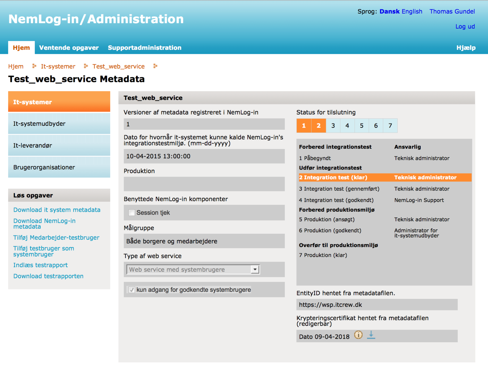
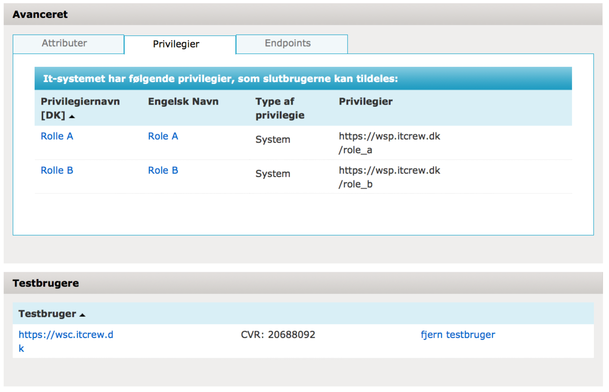
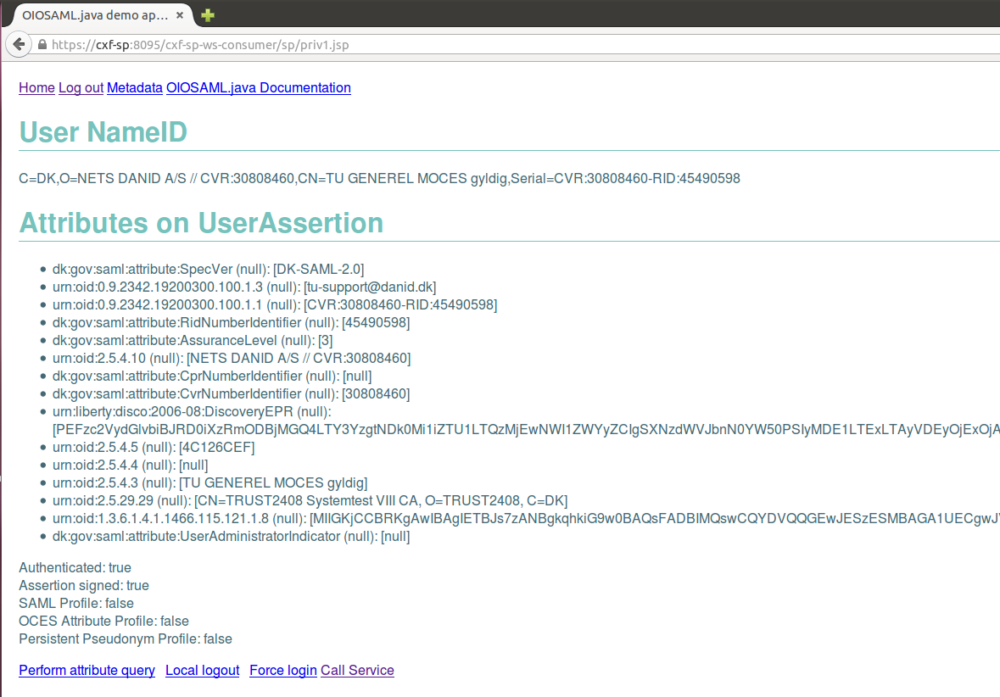
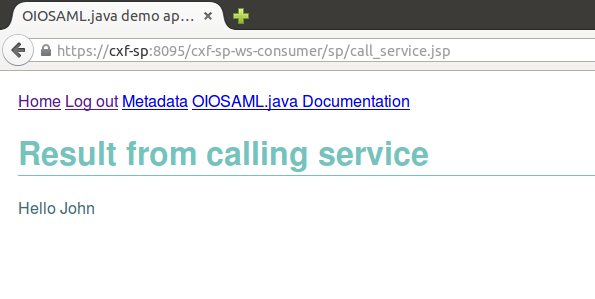
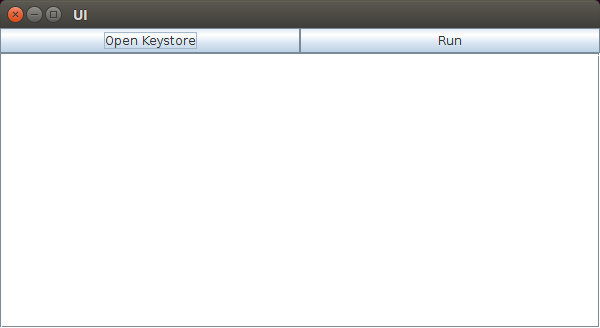
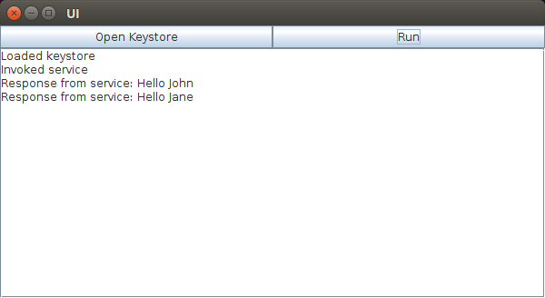

Java Reference Code for

NemLog-in STS Integration

(System User Scenario)

(Bootstrap Scenario)

(Signature Scenario)

Libety Basic SOAP Binding Profile

Status: Version 1.2

Version: 17.07.2018

[Changelog [4](#changelog)](#changelog)

[1 Introduction [5](#introduction)](#introduction)

[1.1 Intended audience [6](#intended-audience)](#intended-audience)

[1.2 Prerequisites [6](#prerequisites)](#prerequisites)

[1.3 Apache CXF Version [6](#apache-cxf-version)](#apache-cxf-version)

[1.4 Disclaimer [6](#disclaimer)](#disclaimer)

[2 Building a Web Service Provider [7](#building-a-web-service-provider)](#building-a-web-service-provider)

[2.1 Registration with NemLog-in [7](#registration-with-nemlog-in)](#registration-with-nemlog-in)

[2.2 WS-SecurityPolicy Configuration [8](#ws-securitypolicy-configuration)](#ws-securitypolicy-configuration)

[2.3 Configuring Keystores for the Service [9](#configuring-keystores-for-the-service)](#configuring-keystores-for-the-service)

[2.4 Support Classes [9](#support-classes)](#support-classes)

[2.4.1 Framework Header [9](#framework-header)](#framework-header)

[2.4.2 Basic Privilege Profile parser [9](#basic-privilege-profile-parser)](#basic-privilege-profile-parser)

[2.5 Additional Configuration of Apache CXF [10](#additional-configuration-of-apache-cxf)](#additional-configuration-of-apache-cxf)

[2.5.1 Disable BSP 1.1 Compliance [10](#disable-bsp-1.1-compliance)](#disable-bsp-1.1-compliance)

[2.6 Building and Testing [10](#building-and-testing)](#building-and-testing)

[2.7 Encrypted Assertion Workarounds [11](#encrypted-assertion-workarounds)](#encrypted-assertion-workarounds)

[2.7.1 Issue 1 – KeyInfo Reference to EncryptedData [11](#issue-1-keyinfo-reference-to-encrypteddata)](#issue-1-keyinfo-reference-to-encrypteddata)

[2.7.2 Issue 2 – STR-Transform on EncryptedData [12](#issue-2-str-transform-on-encrypteddata)](#issue-2-str-transform-on-encrypteddata)

[3 Building a Web Service Consumer [14](#building-a-web-service-consumer)](#building-a-web-service-consumer)

[3.1 Reference Code [14](#reference-code)](#reference-code)

[3.2 Design Choices [14](#design-choices)](#design-choices)

[3.3 Security Requirements [14](#security-requirements)](#security-requirements)

[3.4 WS-SecurityPolicy [14](#ws-securitypolicy)](#ws-securitypolicy)

[3.5 Configuring Keystores for the WSC [15](#configuring-keystores-for-the-wsc)](#configuring-keystores-for-the-wsc)

[3.6 The STSClient Configuration and Implementation [15](#the-stsclient-configuration-and-implementation)](#the-stsclient-configuration-and-implementation)

[3.7 Support Classes [19](#support-classes-1)](#support-classes-1)

[3.8 Additional Configuration of Apache CXF [19](#additional-configuration-of-apache-cxf-1)](#additional-configuration-of-apache-cxf-1)

[3.8.1 Configure BSP 1.1 Compliance [19](#configure-bsp-1.1-compliance)](#configure-bsp-1.1-compliance)

[3.9 Encrypted Assertion Workarounds [19](#encrypted-assertion-workarounds-1)](#encrypted-assertion-workarounds-1)

[3.10 Interoperability with .NET [20](#interoperability-with-.net)](#interoperability-with-.net)

[4 System User Scenario [22](#system-user-scenario)](#system-user-scenario)

[4.1 Using the Client [22](#using-the-client)](#using-the-client)

[5 Bootstrap scenario [23](#bootstrap-scenario)](#bootstrap-scenario)

[5.1 Reference Code [23](#reference-code-1)](#reference-code-1)

[5.2 Implementation Notes [23](#implementation-notes)](#implementation-notes)

[5.3 Getting CXF and OIOSAML.Java to co-exist [24](#getting-cxf-and-oiosaml.java-to-co-exist)](#getting-cxf-and-oiosaml.java-to-co-exist)

[5.3.1 Integrating with NemLog-in SSO [25](#integrating-with-nemlog-in-sso)](#integrating-with-nemlog-in-sso)

[5.3.2 Getting a token and calling a service [26](#getting-a-token-and-calling-a-service)](#getting-a-token-and-calling-a-service)

[5.4 Using the reference code [26](#using-the-reference-code)](#using-the-reference-code)

[6 Signature scenario [29](#signature-scenario)](#signature-scenario)

[6.1 Reference Code [29](#reference-code-2)](#reference-code-2)

[6.2 Implementation Notes [29](#implementation-notes-1)](#implementation-notes-1)

[6.3 The GUI for the desktop application [30](#the-gui-for-the-desktop-application)](#the-gui-for-the-desktop-application)

[6.4 Dealing with the user supplied keystore [30](#dealing-with-the-user-supplied-keystore)](#dealing-with-the-user-supplied-keystore)

[6.4.1 Providing the keystore [30](#providing-the-keystore)](#providing-the-keystore)

[6.4.2 Providing the password [31](#providing-the-password)](#providing-the-password)

[6.4.3 Providing the alias [32](#providing-the-alias)](#providing-the-alias)

[6.4.4 Interaction with the UI [32](#interaction-with-the-ui)](#interaction-with-the-ui)

[6.5 Using the reference code [33](#using-the-reference-code-1)](#using-the-reference-code-1)

[7 Example payloads [35](#example-payloads)](#example-payloads)

[7.1 WSC-TO-STS [35](#wsc-to-sts)](#wsc-to-sts)

[7.2 STS-TO-WSC [35](#sts-to-wsc)](#sts-to-wsc)

[7.3 WSC-TO-WSP [36](#wsc-to-wsp)](#wsc-to-wsp)

[7.4 WSP-TO-WSC [36](#wsp-to-wsc)](#wsp-to-wsc)

[8 Summary [37](#summary)](#summary)

[9 References [38](#references)](#references)

# Changelog

01-12-2015 Initial release

09-03-2018 Updated with OIO IDWS profile, and updated certificates

17-07-2018 Extracted general CXF and WS-SecurityPolicy information into separate document

17-07-2018 Extracted OIO IDWS profile documentation into separate document

# Introduction

This document is a companion to the Java reference source code that showcase how to use the Apache CXF framework to implement a Liberty Basic SOAP Binding solution consisting of

- A Web Service Provider (WSP) that requires clients to present a token issued by the NemLog-in STS, showing how to perform the following validations

  - Require the client to conform to the Basic Liberty SOAP Binding \[LIBERTY\]

  - Parse the issued Basic Privilege Profile \[OIO-BPP\] information in the presented token

  - Ensure that the request is no older than 5 minutes

- A Web Service Consumer (WSC) that can

  - Interact with the NemLog-in STS to get a token issued

  - Call the above WSP with the issued token

  - Validate that the response from the WSP conforms to the Basic Liberty SOAP Binding \[LIBERTY\]

Note that the NemLog-in STS supports a number of different usage scenarios that differ in how authentication to the STS is performed, including bootstrap token case, local token case and signature case illustrated below:

This reference code only covers the following scenarios

1.  The system user scenario where the WSC authenticates to the STS as a system user using a signature (e.g. a FOCES or VOCES certificate). Here, the WSC gets a token to act as the WSC (a system user).

2.  The bootstrap token scenario, where the WSC is also a SAML 2.0 Service Provider, integrated with the NemLog-in SSO. Here the WSC authenticates to the STS using a signature (e.g. a FOCES or VOCES certificate) and exchanges a bootstrap token (representing the user) received during the Web SSO roundtrip. The WSC gets a token to act on behalf of the end-user.

3.  The signature scenario where the WSC authenticates to the STS as a user using the users signature (e.g. a MOCES certificate). The WSC gets a token to act on behalf of the end-user.

Please refer to the NemLog-in documentation for descriptions of the other usage scenarios.

The Apache CXF specific configuration is covered in \[CXF\], and it is recommended to read that document first.

This document will refer to the reference code a lot, so it is also recommended to have the reference code available while reading this document.

## Intended audience

This document is written for developers, and while all configuration and customization of Apache CXF concerning security is dealt with, some experience with Apache CXF or a similar web service framework is recommended. The reader is also expected to have experience with Java development in general.

## Prerequisites

The source code uses Apache Maven 3 \[MAVEN\] as a build tool, and the source code requires at least Java 7 with Strong Crypto \[CRYPTO\] to compile and run. The reader is expected to have these tools available before using the reference source code. Maven handles all other dependencies.

## Apache CXF Version

The reference code is based on Apache CXF 3.0.16, but the same concepts outlined in this document can be applied to the 3.1.x and 3.2.x branches of CXF.

## Disclaimer

The Danish Agency for Digitisation provides the reference code as is and assumes no responsibility for the code by service providers. Service Providers should understand the limitations of the code and deal with these according to their own needs.

# Building a Web Service Provider

In this chapter we will show how to implement a WSP using CXF, and configure it to either require a holder-of-key token or a bearer token from the WSC.

It is the same WSP, but with two different implementations – in the reference code these are located in the service-hok and service-bearer folders.

## Registration with NemLog-in

The example WSC and WSP have been registered with NemLog-in[^1] to make the example work:

- The client (WSC) is registered as a system user with EntityID “https://wsc.itcrew.dk”.

- The WSP is registered as a web service with the EntityID “<https://wsp.itcrew.dk>” with two privileges (roles). The client has been granted these two privileges by the administrator of the WSP such they will appear in tokens issued by the STS to the WSP.

The process of registering with NemLog-in is not covered in this guide, but a detailed process description with associated screenshots will be provided on Digitaliser.dk in the group[^2]: A screen shot showing the registration details for the WSP is shown below:

## WS-SecurityPolicy Configuration

Implementing \[LBSB\] using WS-SecurityPolicy is partially possible. Certain aspects of LBSB needs to be dealt with using custom code, and specific integrations with the NemLog-in STS requires custom code as well.

With regards to the WS-SecurityPolicy specific configuration, this is done in the WSDL file for the WSP. There are minor differences between the holder-of-key and bearer versions of the security policies.

LBSB mandates that the request is signed by the WSC (body as well as a specific list of SOAP headers), so the major difference is with the validation process – the WSP can use the token to validate the signature in the holder-of-key case, but in the bearer case no subject confirmation data is available in the token, so a pre-configured trust must be established (see details in the following chapters).

See the \[CXF\] document for the details on configuring WS-SecurityPolicy in the WSDL. LBSB requires the use of SignedSupportingTokens as it mandates that all tokens are signed, but in the bearer token case, the WSC must send its X.509 certificate as a BinarySecurityToken, so the InitiatorToken must have its IncludeToken attribute set to “AlwaysToRecipient”.

To ensure that the WSC does not sign the request twice, remove the “WssSamlV20Token11” element from the SignedSupportingToken (otherwise the WSC will sign the message with both its X.509 certificate and its SAML token).

The full policies are embedded in the WSDL files found in the service-hok and service-bearer folders.

## Configuring Keystores for the Service

The WSP must be configured with its own keystore, containing both a certificate and a private key. This keystore is used when signing the responses send to the WSCs.

The WSP must also be configured with a truststore, containing the certificate used by the STS, as this is used to validate the tokens received from the WSCs (which they in turn have received from the STS).

In the bearer case, the WSP truststore must also contain the required certificates to validate signatures performed by the WSCs. This can either by the individual WSC certificates, or the CA that has issued the certificates that the WSP trusts.

Trusting individual WSCs requires a certain amount of administrative work, as each WSC must be registered before they can call the WSP.

In the reference code the Nets CA for OCES certificates is trusted.

## Support Classes

### Framework Header

LBSB requires that all requests and responses contains a Framework SOAP header, and that it has the mustUnderstand attribute set to “1”. As mentioned in \[CXF\], this means that a set of interceptors must be implemented, and configured to both understand and validate the header on incoming requests, as well as add the header to outgoing responses.

The details on how to accomplish this can be found in \[CXF\], and the full source can be found with the reference code.

### Basic Privilege Profile parser

The NemLog-in STS issues tokens to the WSC that contains information on what privileges that the WSC is granted on the WSP. The WSP needs to parse these attributes from the token supplied with the request.

In the reference code this is implemented as detailed in \[CXF\], and the main service class (HelloWorldPortTypeImpl.java) shows how to access this information at runtime.

A production-ready implementation of a WSP would likely hook this information into an authorization mechanism and/or framework.

## Additional Configuration of Apache CXF

### Disable BSP 1.1 Compliance

The Apache CXF framework enforces Basic Security Profile 1.1 compliance by default, and as CXF does not have full support for encrypted tokens, this causes some validation errors to occur during BSP 1.1 compliance checking. Because of this we must disable BSP 1.1 compliance checking. This is done in the apache-cxf.xml configuration file, and the relevant settings are shown below

\<jaxws:endpoint\>

\<jaxws:properties\>

\<entry key=**"ws-security.is-bsp-compliant"** value=**"false"** /\>

\</jaxws:properties\>

\</jaxws:endpoint\>

## Building and Testing

To build and test the service, perform the following commands from the command-line. Make sure to execute the command from the root of the source folder (where the main pom.xml file is located)

\$ mvn clean install

This will compile both versions of the service.

Once the project has been compiled, go into either of the service folders, and start that specific service by running the following command (please note that both services cannot run at the same time)

\$ mvn tomcat7:run-war

This will launch the service on the following URL

<http://localhost:8080/HelloWorld/services/>

Testing that the service works will require a web service consumer. The following chapters covers how to build different types of web service consumers that can call the services.

##  Encrypted Assertion Workarounds

The Apache CXF framework does not fully support all use cases with EncryptedAssertion elements, and especially it does not support the Holder-of-key use-case used by the Liberty Basic SOAP Binding profile.

The root cause is the way that Apache CXF deals with encrypted elements. Whenever Apache CXF decrypts an element, it will replace the encrypted value in the DOM with the corresponding decrypted value, so the token issued by the STS, will go from this

\<EncryptedAssertion\>

\<EncryptedData id=**"encryptedDataId"**\>

\<EncryptionMethod /\>

\<KeyInfo /\>

\<CipherData /\>

\</EncryptedData\>

\</EncryptedAssertion\>

to this

\<Assertion id=**"decryptedDataId"**\>

\<Issuer /\>

\<Signature /\>

\<Subject /\>

\<Conditions /\>

\<AttributeStatement /\>

\</Assertion\>

Note that only the service can decrypt this token, so the client calling the service has no way of knowing what the ID of the \<Assertion\> element is, which leads us to the first of two issues

### Issue 1 – KeyInfo Reference to EncryptedData

The client has signed the request according to the Liberty Basic SOAP Binding, and the service must validate this signature. The client has, correctly, referenced the token using a SecurityTokenReference element, using the ID of the EncryptedData element inside the EncryptedAssertion. When the service needs to validate the signature, the ID referenced by the SecurityTokenReference no longer exists (as the element has been decrypted), and the lookup fails, causing the signature validation to fail.

To solve this issue, the code in CXF that is responsible for dereferencing the element has been modified slightly. The workaround does by allowing any lookup that attempts to dereference an element with the ID “encryptedassertion” to match the first decrypted Assertion element in the DOM structure. As the ID of the EncryptedData element is ALWAYS set to “encryptedassertion” by the NemLog-in STS, this will work.

The method that has been overwritten is displayed below, and it is found within the class WSDocInfo, located in the ***wss4j-ws-security-dom*** module used by CXF.

public WSSecurityEngineResult getResult**(**String uri**)** **{**

String id **=** uri**;**

**if** **(**id **==** **null)** **{**

**return** **null;**

**}** **else** **if** **(**id**.**charAt**(**0**)** **==** '#'**)** **{**

id **=** id**.**substring**(**1**);**

**}**

**if** **(**resultsList **!=** **null)** **{**

**for** **(**WSSecurityEngineResult result **:** resultsList**)** **{**

**if** **(**result **!=** **null)** **{**

// START DIGST WORKAROUND

**if** **(**"encryptedassertion"**.**equals**(**id**))** **{**

Object samlAssertion **=** result**.**get**(**

WSSecurityEngineResult**.**TAG_SAML_ASSERTION**);**

**if** **(**samlAssertion **!=** **null)** **{**

**return** result**;**

**}**

**}**

// END DIGST WORKAROUND

String cId **=** **(**String**)**result**.**get**(**WSSecurityEngineResult**.**TAG_ID**);**

**if** **(**id**.**equals**(**cId**))** **{**

**return** result**;**

**}**

**}**

**}**

**}**

**return** **null;**

**}**

Note that this workaround has been applied to version 2.0.10 of this module in the reference code. If another version of the wss4j module is used, the override should be applied to that version to ensure compatibility.

The reference code contains the modified source code for the files mentioned, which are compiled together with the project code – the java class loader will load the modified versions of these files rather than the ones distributed with CXF and WSS4J.

### Issue 2 – STR-Transform on EncryptedData

The WSC must sign the token, which is done using a SecurityTokenReference, and the STR-Transform algorithm. The STR-Transform requires that the referenced element has a default namespace, and if one does not exist, it will either inherit the namespace from the parent element, or emit an empty default namespace (xmlns="").

As the EncryptedData element does not contain a default namespace, it should inherit the value from the parent element. In this case the EncryptedAssertion element. This element has a default namespace with the value (xmlns="urn:oasis:names:tc:SAML:2.0:assertion").

The WSC will correctly compute this value, but the WSP will not. Due to the way Encrypted elements are replaced by the corresponding decrypted values in the DOM, this means that the EncryptedData element will be orphaned, and thus will not have a parent. This will cause the STR-Transform algorithm to emit an empty default namespace when performing the Transform.

The end-result is that the WSC and the WSP will not compute the same digest for the SecurityTokenReference, and the signature check will fail.

To solve this issue, the code in CXF that is responsible for computing the STR-Transform has been modified slightly. In the very specific case, where the element to compute the STR-Transform on has the ID “encryptedassertion”, and the element does not have a parent element, code has been added to create a dummy parent element, where this parent element contains the expected default namespace (xmlns="urn:oasis:names:tc:SAML:2.0:assertion").

The method that has been overridden is displayed below, trimmed to display only the relevant sections of the method. The method itself can be found in the class STRTransform located in the ***wss4j-ws-security-dom*** module used by CXF (the same module as in issue 1).

private Data transformIt**(**Data data**,** XMLCryptoContext xc**,** OutputStream os**)** **{**

**...** snip **...**

**if** **(**dereferencedToken **!=** **null)** **{**

**...** snip **...**

**}**

// BEGIN DIGST WORKAROUND

boolean parentNodeIsNull **=** **(**dereferencedToken**.**getParentNode**()** **==** **null);**

boolean encryptedAssertionId **=**

**(**dereferencedToken**.**getAttribute**(**"wsu:Id"**) !=** **null** **&&**

dereferencedToken**.**getAttribute**(**"wsu:Id"**).**equals**(**"encryptedassertion"**));**

**if** **(**parentNodeIsNull **&&** encryptedAssertionId**)** **{**

DocumentBuilderFactory factory **=** DocumentBuilderFactory**.**newInstance**();**

DocumentBuilder documentBuilder **=** factory**.**newDocumentBuilder**();**

Document document **=** documentBuilder**.**newDocument**();**

Element encryptedAssertion **=** document**.**createElement**(**"EncryptedAssertion"**);**

encryptedAssertion**.**setAttributeNS**(**"<u>http://www.w3.org/2000/xmlns/</u>"**,**

"xmlns"**,**

"urn:oasis:names:tc:SAML:2.0:assertion"**);**

dereferencedToken **=** **(**Element**)** document**.**importNode**(**

dereferencedToken**,** **true);**

encryptedAssertion**.**appendChild**(**dereferencedToken**);**

dereferencedToken = encryptedAssertion;

NodeList securityTokenReferences =

dereferencedToken.getElementsByTagName("o:SecurityTokenReference");

if ((securityTokenReferences.getLength() \> 0) &&

((securityTokenReferences.item(0) instanceof Element)))

{

Element securityTokenReference = (Element)

securityTokenReferences.item(0);

securityTokenReference.setAttributeNS(

"http://www.w3.org/2000/xmlns/",

"xmlns:o",

"http://docs.oasis-open.org/wss/2004/01/oasis-200401-wss-wssecurity-secext-1.0.xsd");

**}**

**}**

// END DIGST WORKAROUND

//

// C14n with specified algorithm. According to WSS Specification.

//

buf **=** canon**.**canonicalizeSubtree**(**dereferencedToken**,** "#default"**,** **true);**

**...** snip **...**

**}**

This workaround has been applied to the same version of the wss4j module as in issue 1, and is part of the source that comes with the reference code.

# Building a Web Service Consumer

This chapter covers all the steps necessary to build a WSP capable of calling a WSP secured as detailed in the previous chapter. This includes calling the STS and getting a token, as well as securing the request to the service in a way compliant with the Basic Liberty SOAP Binding.

## Reference Code

There are three different scenarios implemented as individual WSCs. This chapter covers the generic configuration and implementation, and the following chapters covers the details specific for each of the scenarios.

The reference code for each scenario is found in individual subfolders.

## Design Choices

As with the WSP in the previous chapter, the reference code for the WSC uses an XML-based configuration approach. It is possible to setup the same configuration using code, though this is not covered by this document.

## Security Requirements

The WSC must be configured to follow the security requirements of both the STS and the WSP it wants to call. It must also ensure that it follows the requirements detailed by the Basic Liberty SOAP Binding \[LIBERTY\].

Using Apache CXF this can be accomplished in two ways. The recommended way is to use WS-SecurityPolicy \[WS-SEC-POL\], and the alternate way is to use WSS4J Interceptors. We will use the recommended approach, and configure the WSC using WS-SecurityPolicy.

The WSC must also be configured to trust the WSP, as the response from the WSP is signed. This requires that we setup a keystore that contains the public certificate of the WSP, and configure this as a truststore in Apache CXF.

Finally, the STS must be aware of the WSC, so it can issue token to the client. This is outside the scope of this document, and the reference source for the WSPs in this prfile has already been registered with the STS under the following EntityId:

<https://wsc.itcrew.dk>

## WS-SecurityPolicy

The WSDL of the NemLog-in STS contains a wsp:Policy section, but unfortunately the policy section is not representative of the actual security requirements for calling the STS, so we will have to create our own.

Also, the WSDL of the NemLog-in STS does not contain the operations usually found in a WSDL for a WS-Trust compliant STS. For this reason, we will create a WSDL from scratch for the STS, and completely ignore the WSDL presented by the NemLog-in STS.

The reference code contains a WSDL (src/main/resources/sts.wsdl) that has the Issue operation exposed by the NemLog-in STS, and contains the required wsp:Policy section. The WSDL is modelled after the WSDL found in the WS-Trust 1.4 specification \[TRUST-WSDL\].

Please note that the WSDL has the URL of the test-STS hardcoded, and this should be changed to point to the URL of the production STS before using this in production.

Look at the sts.wsdl file found in the scenario implementations for the full details of the security policy added to the WSDL.

With the above policy in place, the Apache CXF framework will be able to create a valid RequestSecurityToken request for the STS, and sign it in the expected way. Note that we will have to write some supporting code for the request, as the STS requires some specific addressing headers; this is covered later in this chapter.

## Configuring Keystores for the WSC

Like the WSP, the WSC must be configured with 2 keystores. The first keystore contains the clients certificate and corresponding private key. The second keystore is a truststore, containing the public certificate of the STS as well as the WSPs that the WSC wishes to call. In the reference code these two keystores are called client.jks and trust.jks, and the configuration file called client.properties is similar to the serviceKeystore.properties described in the previous chapter.

Note that it is also possible to have a truststore that contains CA certificates that are trusted. For instance, the trust.jks keystore could just contain the OCES CA certificate, and trust would then be established to all OCES certificates issued by that CA. Note that by having a keystore, that only contains the certificates of the WSP that the WSC is communicating with, we have a much better control over who the client trusts.

As mentioned in the previous chapter, Apache CXF sometimes use the password configured in the properties file, and sometimes it requires a callback handler to give it the password. In the reference code, a class like the one found in the WSP project has been added to deal with this.

The XML configuration file for the client is called cxf.xml, and the relevant parts for configuring keystores is shown below

\<jaxws:client\>

\<jaxws:properties\>

\<entry key=**"ws-security.signature.username"**

value=**"client"** /\>

\<entry key=**"ws-security.signature.properties"**

value=**"client.properties"** /\>

\<entry key=**"ws-security.callback-handler"**

value=**"client.callback.ClientCallbackHandler"** /\>

\</jaxws:properties\>

\</jaxws:client\>

Note that the above section of the configuration file only deals with the communication with the WSP. The configuration for communicating with the STS (including keystore configuration) is covered below

## The STSClient Configuration and Implementation

The Apache CXF framework has a class called STSClient, which can normally be configured to call an STS, without the need for additional code. Unfortunately, the STSClient is not fully compliant with the NemLog-in STS, so we will have to write our own STSClient by extending the existing class.

The three issues are:

1.  The NemLog-in STS requires that the @Context attribute on the RequestSecurityToken element contains a unique value for each request. The Apache CXF framework allows for configuring a static value.

2.  The NemLog-in STS requires that the WS-SecurityPolicy namespace used in the AppliesTo element is the WS-SecurityPolicy 1.1 namespace. The Apache CXF framework uses a later version.

3.  The NemLog-in STS requires some specific addressing headers. The STSClient implementation does not offer an easy way to modify the addressing headers, so an interceptor is implemented to deal with this.

The reference code contains a class called DigstSTSClient that includes the needed code to deal with these three issues. It is shown below:

public class DigstSTSClient **extends** STSClient **{**

public DigstSTSClient**(**Bus b**)** **{**

**super(**b**);**

**this.**out**.**add**(new** STSAddressingInterceptor**());**

createUniqueContextAttribute**();**

**}**

@Override

protected void addAppliesTo**(**XMLStreamWriter writer**,**

String appliesTo**)** **throws** XMLStreamException **{**

createUniqueContextAttribute**();**

**if** **(**appliesTo **!=** **null** **&&** addressingNamespace **!=** **null)** **{**

writer**.**writeStartElement**(**"wsp"**,** "AppliesTo"**,**

"<u>http://schemas.xmlsoap.org/ws/2002/12/policy</u>"**);**

writer**.**writeNamespace**(**"wsp"**,**

"<u>http://schemas.xmlsoap.org/ws/2002/12/policy</u>"**);**

writer**.**writeStartElement**(**"wsa"**,** "EndpointReference"**,**

addressingNamespace**);**

writer**.**writeNamespace**(**"wsa"**,** addressingNamespace**);**

writer**.**writeStartElement**(**"wsa"**,** "Address"**,**

addressingNamespace**);**

writer**.**writeCharacters**(**appliesTo**);**

writer**.**writeEndElement**();**

writer**.**writeEndElement**();**

writer**.**writeEndElement**();**

**}**

**}**

private void createUniqueContextAttribute**()** **{**

**this.**context **=** "urn:uuid:" **+** UUID**.**randomUUID**().**toString**();**

**}**

**}**

Note that the class depends on an Interceptor implementation that can add the expected addressing headers. The code for this interceptor is shown below

public class STSAddressingInterceptor **extends** AbstractSoapInterceptor **{**

public STSAddressingInterceptor**()** **{**

**super(**Phase**.**PRE_PROTOCOL**);**

**}**

@Override

public void handleMessage**(**SoapMessage message**)** **throws** Fault **{**

List**\<**Header**\>** headers **=** message**.**getHeaders**();**

ObjectFactory wsAddressingFactory **=** **new** ObjectFactory**();**

AttributedURIType to **=** **new** AttributedURIType**();**

AttributedURIType messageId **=** **new** AttributedURIType**();**

AttributedURIType action **=** **new** AttributedURIType**();**

to**.**setValue**(**"<u>https://signature.sts.nemlog-in.dk/</u>"**);**

action**.**setValue**(**"<u>http://docs.oasis-open.org/ws-sx/ws-trust/200512/RST/Issue</u>"**);**

messageId**.**setValue**(**"uuid:" **+** UUID**.**randomUUID**().**toString**());**

JAXBElement**\<**AttributedURIType**\>** createTo **=** wsAddressingFactory**.**createTo**(**to**);**

JAXBElement**\<**AttributedURIType**\>** msgId **=** wsAddressingFactory**.**createMessageID**(**messageId**);**

JAXBElement**\<**AttributedURIType**\>** newAction **=** wsAddressingFactory**.**createAction**(**action**);**

JAXBDataBinding jaxbDataBinding **=** **null;**

**try** **{**

jaxbDataBinding **=**

**new** JAXBDataBinding**(**AttributedURIType**.**class**);**

**}**

**catch** **(**JAXBException ex**)** **{**

**throw** **new** XMLFault**(**ex**.**getMessage**());**

**}**

Header toHeader **=** **new** Header**(**

**new** QName**(**"<u>http://www.w3.org/2005/08/addressing</u>"**),**

createTo**,** jaxbDataBinding**);**

Header msgIdHeader **=** **new** Header**(**

**new** QName**(**"<u>http://www.w3.org/2005/08/addressing</u>"**),**

msgId**,** jaxbDataBinding**);**

Header actionHeader **=** **new** Header**(**

**new** QName**(**"<u>http://www.w3.org/2005/08/addressing</u>"**),**

newAction**,** jaxbDataBinding**);**

headers**.**add**(**actionHeader**);**

headers**.**add**(**msgIdHeader**);**

headers**.**add**(**toHeader**);**

message**.**put**(**Header**.**HEADER_LIST**,** headers**);**

**}**

**}**

Note that the wsa:To header above is set to the value used by the STS in the Signature Scenario. The STS supports other scenarios, and this value should be changed if one of the other scenarios is used.

Finally, the DigstSTSClient class must be configured in the cxf.xml configuration file, which is done as shown below

\<jaxws:client\>

\<jaxws:properties\>

\<entry key=**"ws-security.sts.applies-to"**

value=**"<u>https://wsp.itcrew.dk</u>"** /\>

\<entry key=**"ws-security.sts.client"**\>

\<bean class=**"client.sts.DigstSTSClient"**\>

\<constructor-arg ref=**"cxf"** /\>

\<property name=**"wsdlLocation"**

value=**"src/main/resources/sts.wsdl"** /\>

\<property name=**"serviceName"**

value=**"{<u>http://docs.oasis-open.org/ws-sx/ws-trust/200512/}SecurityTokenService</u>"** /\>

\<property name=**"endpointName"**

value=**"{<u>http://docs.oasis-open.org/ws-sx/ws-trust/200512/}STS_Port</u>"** /\>

\<property name=**"sendRenewing"** value=**"false"** /\>

\<property name=**"sendKeyType"** value=**"false"** /\>

\<property name=**"requiresEntropy"** value=**"false"** /\>

\<property name=**"tokenType"**

value =**"<u>http://docs.oasis-open.org/wss/oasis-wss-saml-token-profile-1.1#SAMLV2.0</u>"** /\>

\<property name=**"properties"**\>

\<map\>

\<entry key=**"ws-security.signature.username"**

value=**"client"** /\>

\<entry key=**"ws-security.signature.properties"**

value=**"client.properties"** /\>

\<entry key=**"ws-security.encryption.username"**

value=**"sts"** /\>

\<entry key=**"ws-security.encryption.properties"**

value=**"sts.properties"**/\>

\</map\>

\</property\>

\</bean\>

\</entry\>

\</jaxws:properties\>

\</jaxws:client\>

The client properties contain an entry for the value ws-security.sts.applies-to, this is needed to ensure that the STS knows which kind of token to issue, as it informs the STS which service the WSC intend to call with the token. In the reference code this contains the EntityId of the service created in the previous chapter.

Note that the STSClient configuration points to the WSDL file, which contains the wsp:Policy section that the STSClient must follow when making the request to the STS.

There is a set of property values that disables a range of settings, as the STSClient by default sends a lot of additional parameters to the STS (renewing, entropy, etc). As the STS does not support these parameters, they have been disabled.

Finally, the keystore values are configured, and note that the STS requires only property files and no callback handlers, though it does require two property files, one for the client certificate and another for the truststore.

## Support Classes

The WSC must send and understand the sbf:Framework header, and for that purpose the same two supporting classes found in the WSP project is used in the client project.

FrameworkHeaderInterceptor is used to inject the Framework header in outgoing requests.

SbfFrameworkHeader is the model class that is marshalled into XML by the above interceptor.

## Additional Configuration of Apache CXF

### Configure BSP 1.1 Compliance

The Apache CXF framework enforces Basic Security Profile 1.1 compliance by default, which contains the following rule

**R5412**

Any SIG_TRANSFORMS MUST contain as its last child a SIG_TRANSFORM with an Algorithm attribute with a value of "http://www.w3.org/2001/10/xml-exc-c14n#" or "http://docs.oasis-open.org/wss/2004/01/oasis-200401-wss-soap-message-security-1.0#STR-Transform" or "http://docs.oasis-open.org/wss/oasis-wss-SwAProfile-1.1#Attachment-Content-Signature-Transform" or "http://docs.oasis-open.org/wss/oasis-wss-SwAProfile-1.1#Attachment-Complete-Signature-Transform".

But the response from the STS does not conform to this rule, causing the CXF framework to reject the response. To avoid this, BSP 1.1 compliance must be disabled like this

\<jaxws:client\>

\<jaxws:properties\>

\<entry key=**"ws-security.is-bsp-compliant"** value=**"false"** /\>

\</jaxws:properties\>

\</jaxws:client\>

## Encrypted Assertion Workarounds

As with the WSP, the WSC must be able to deal correctly with encrypted assertions. The changes in the client case is minimal, and is simply a matter of getting the correct element when the assertion is referenced.

This is done by modifying the same method as in the WSP case, though slightly simpler.

The method that has been overridden is displayed below, trimmed to display only the relevant sections of the method. The method itself can be found in the class STRTransform located in the ***wss4j-ws-security-dom*** module used by CXF (the same module as in issue 1).

private Data transformIt**(**Data data**,** XMLCryptoContext xc**,** OutputStream os**)** **{**

**...** snip **...**

**if** **(**dereferencedToken **!=** **null)** **{**

**...** snip **...**

**}**

// BEGIN DIGST WORKAROUND

boolean parentNodeIsNull **=** **(**dereferencedToken**.**getParentNode**()** **==** **null);**

boolean encryptedAssertionId **=**

**(**dereferencedToken**.**getAttribute**(**"wsu:Id"**) !=** **null** **&&**

dereferencedToken**.**getAttribute**(**"wsu:Id"**).**equals**(**"encryptedassertion"**));**

**if** **(!**parentNodeIsNull **&&** encryptedAssertionId**)** **{**

dereferencedToken **= (**Element**)**dereferencedToken**.**getParentNode**();**

**}**

// END DIGST WORKAROUND

//

// C14n with specified algorithm. According to WSS Specification.

//

buf **=** canon**.**canonicalizeSubtree**(**dereferencedToken**,** "#default"**,** **true);**

**...** snip **...**

**}**

This workaround has been applied to the CXF source files found in the reference code.

## Interoperability with .NET

The Apache CXF framework is not fully interoperable with .NET when it comes to dealing with encrypted assertions, so another modification is required to ensure that CXF generates the references as expected by .NET.

The method that has been overwritten is displayed below, and it is found within the class AbstractBindingBuilder, located in the ***cxf-rt-ws-security*** module used by CXF.

protected WSSecSignature getSignatureBuilder**(**AbstractToken token**,**

boolean attached**,** boolean endorse**)** **throws** WSSecurityException **{**

// ... snip ...

// remove this line and replace it with the code below

// SecurityTokenReference secRef = new

// SecurityTokenReference(cloneElement(ref), new BSPEnforcer());

// replace with this

String id = securityToken.getId();

SecurityTokenReference secRef **=** **null;**

**if** **((**id **!=** **null)** **&&** **(**id**.**equals**(**"encryptedassertion"**)))** **{**

Document doc **=** ref**.**getOwnerDocument**();**

secRef **=** **new** SecurityTokenReference**(**doc**);**

secRef**.**addTokenType**(**"http://docs.oasis-open.org/wss/oasis-wss-saml-token-profile-1.1#SAMLV2.0"**);**

Element keyId **=** doc**.**createElementNS**(**"http://docs.oasis-open.org/wss/2004/01/oasis-200401-wss-wssecurity-secext-1.0.xsd"**,** "wsse:KeyIdentifier"**);**

keyId**.**setAttributeNS**(null,** "ValueType"**,** "http://docs.oasis-open.org/wss/oasis-wss-saml-token-profile-1.1#SAMLID"**);**

keyId**.**appendChild**(**doc**.**createTextNode**(**id**));**

Element elem **=** secRef**.**getElement**();**

elem**.**appendChild**(**keyId**);**

**}**

**else** **{**

secRef **=** **new** SecurityTokenReference**(**cloneElement**(**ref**),** **new** BSPEnforcer**());**

**}**

// ... snip ....

**}**

# System User Scenario

The System User Scenario is the simplest of the implemented scenarios. Here the WSC fetches a holder-of-key token from the STS, and uses it to make a service call to the WSP. It showcases how to re-use the token to make 2 consecutive calls, where only the first call requires fetching a token, and the second call reuses the fetched token.

The source for the WSC can be found in the “system-user-scenario” folder, and it requires the “service-hok” WSP to be running.

## Using the Client

The project can be compiled using Maven with the following command. Make sure that the command is issued from the directory that contains the pom.xml for this project

\$ mvn clean install

This will compile the client project as a command-line application. The WSC can be executed by using the following Maven command

\$ mvn exec:exec

This will execute the code in the WSClient.java class. The class simply calls the method HelloWorld on the HelloWorld service, and the Apache CXF configuration will ensure that the STS is called first, and the result of the call to the STS cached, so the token is reused on the two following calls to the HelloWorld service.

A third call is made to the WSP, this time causing the WSP to return a SOAPFault because an empty parameter is supplied to the operation, the code shows how the WSC can deal with this type of error.

It is assumed that the holder-of-key version of the HelloWorld WSP is running. See chapter [2.6](#building-and-testing) for details on how to start the WSP.

Also note that tracing is enabled on both the service and client projects, so the console will contain the full request and response payloads towards both the service and the STS.

# Bootstrap scenario

In the Bootstrap Scenario, the WSC is also a SAML Service Provider (SP), and the SAML token received from the end-user during login, is used as input to the STS when requesting a token. The token that the WSC then use to call the WSP contain information about the end-user.

The Bootstrap Scenario reference code covers the steps necessary to combine the OIOSAML.Java framework with Apache CXF to build a Web Service Consumer that is also a SAML 2.0 Service Provider.

The purpose is to showcase the following scenario:

1.  A user signs on to the Service Provider, through the NemLog-in SSO. The Service Provider is presented with a user-specific token (SAML 2.0 Assertion) from the NemLog-in SSO.

2.  The Service Provider, acting as a WSC, calls the NemLog-in STS to get a token, where a bootstrap Assertion embedded in the Web SSO Assertion is presented as part of the request.

3.  The NemLog-in STS issues a token to the WSC, containing the user’s identity.

4.  The WSC then calls WSP using this token

## Reference Code

The code for the Bootstrap Scenario is found in the folder “bootstrap-scenario” in the root of the reference code distribution. The project is self-contained, and does not directly depend on any of the other modules in the reference code distribution (to test the code, it does require the service found in the folder “service-hok” to be running).

## Implementation Notes

The Bootstrap Scenario is very similar (with regards to CXF) to the previous System User Scenario, and there are only minor differences in the two sets of reference code. These differences are listed below

1.  The WSClient class is no longer needed

The WSClient class is the “main” class in the System User Scenario. In the Bootstrap Scenario, the flow is driven by a webpage instead.

2.  STSAdressingInterceptor differs

This class is responsible for setting the wsa:To header field in the soap call to the STS, and since the Bootstrap Scenario requires a different wsa:To header value, this line needs to be modified to

to**.**setValue**(**"https://bootstrap.sts.nemlog-in.dk/"**);**

3.  DigstSTSClient differs

The DigstSTSClient is the class that is responsible for calling the STS to get a token. As the major difference between the Bootstrap Scenario and the System User Scenario is how the token is retrieved from the STS, this is where most of the differences between the two scenarios are present.

We need to set the ActAs value to the request, and the easiest way to do this, is to override the issue() method found in the STSClient base class.

@Override

protected STSResponse issue**(**String appliesTo**,** String action**,**

String requestType**,** String binExc**)** **throws** Exception **{**

UserAssertion userAssertion **=** UserAssertionHolder**.**get**();**

UserAttribute attribute **=** userAssertion**.**getAttribute**(**

"urn:liberty:disco:2006-08:DiscoveryEPR"**);**

byte**\[\]** rawAsrt **=** Base64**.**decodeBase64**(**attribute**.**getValue**());**

setActAs**(new** String**(**rawAsrt**,** Charset**.**forName**(**"UTF-8"**)));**

**return** **super.**issue**(**appliesTo**,** action**,** requestType**,** binExc**);**

**}**

The above code uses the OIOSAML UserAssertionHolder class to get access to the UserAssertion that was supplied by the end-user when he signed on to the web-application. From this class we can extract the “urn:liberty:disco:2006-08:DiscoveryEPR” attribute, which contains a base64 encoded SAML 2.0 Assertion (bootstrap token), which we can supply to the STS as an ActAs argument in the request for a token.

With the above modifications, the CXF code is ready to be used in conjunction with OIOSAML.Java, which will be responsible for supplying the UserAssertion element.

## Getting CXF and OIOSAML.Java to co-exist

Disclaimer: This document is not intended as a guide on how to use OIOSAML.Java, nor will it go into details about best practices when it comes to using that framework. It will cover the necessary steps to get OIOSAML.Java to peacefully co-exist with Apache CXF, and the reference code contains an integration of OIOSAML.Java.

To reduce custom configuration of OIOSAML.Java, the reference code uses the demo service provider project found in the OIOSAML.Java distribution, this constitutes the following resource files from the demo project

├── oiosaml-config

│   ├── oiosaml-sp.log4j.xml

│   └── oiosaml-sp.properties

├── src

│   └── main

│   └── webapp

│   ├── configure.jsp

│   ├── head.jsp

│   ├── index.jsp

│   ├── oiosaml.gif

│   ├── postlogin.jsp

│   ├── sp

│   │   ├── logout.jsp

│   │   ├── post.jsp

│   │   ├── priv1.jsp

│   │   └── query.jsp

│   └── WEB-INF

│   ├── classes

│   │   └── log4j.properties

│   └── web.xml

As well as the OIOSAML.Java library itself, which is included as a Maven dependency.

Adding both the CXF and OIOSAML.Java dependencies to the Bootstrap Scenarios Maven pom file results in only a single conflict. The two frameworks disagree on which version of xmlsec to use. CXF requires the highest version of this library (version 2.0.8), and OIOSAML.Java can use this version without any issues, so a direct dependency to this specific version of xmlsec has been added to the project.

### Integrating with NemLog-in SSO

Integration with the NemLog-in SSO is covered by the NemLog-in documentation, and is not covered in any detail in this document[^3]. The reference code comes with a working integration, which constitutes the following files in the reference code

├── oiosaml-config

│   ├── certificate

│   │   └── keystore

│   ├── metadata

│   │   ├── IdP

│   │   │   └── IdPMetadata.xml

│   │   └── SP

│   │   └── SPMetadata.xml

├── ssl-keystore

1.  The keystore file is a FOCES certificate, and it is a requirement that this FOCES certificate is the same certificate as the one used to call the STS (which CXF requires is located in /src/main/resources). The client.jks file located here is an exact copy of the keystore file in the oiosaml-config/certificate folder

2.  The IdPMetadata.xml file is copied from the NemLog-in webpage, and contains the metadata for the TEST environment of the NemLog-in SSO.

3.  The SPMetadata.xml is generated by the OIOSAML.Java library, and trust towards this set of metadata has been established in the NemLog-in SSO

4.  As the NemLog-in SSO requires all Service Providers to use TLS/SSL, a self-signed SSL certificate has been generated, and it is located in the ssl-keystore file.

As the SPMetadata.xml file contains the URLs that the NemLog-in SSO must send SAML-Responses to, a fully qualified URL has been chosen for this purpose.

<https://cxf-sp:8095/cxf-sp-ws-consumer/>

Please note that for the bootstrap scenario to work, the metadata that is exchanged with the NemLog-in SSO must contain the following RequestedAttribute element (it triggers issuance of bootstrap tokens):

\<md:RequestedAttribute Name=**"urn:liberty:disco:2006-08:DiscoveryEPR"**

NameFormat=**"urn:oasis:names:tc:SAML:2.0:attrname-format:basic"**

isRequired=**"false"**/\>

The metadata in the reference source has this property set. Without it the NemLog-in SSO will not return the attribute we need to extract a valid bootstrap token.

### Getting a token and calling a service

In the System User Scenario, we had a main method in the WSClient class that was responsible for executing the flow, but in the Bootstrap Scenario, the webpage drives the flow.

After a successful login, the end-user is presented with the webpage priv1.jsp. In the reference code, this JSP page has been modified to contain a link to a new page (call_service.jsp). This new JSP page contains the code from WSClient, and accessing it will force CXF to call the STS to get a token, and then use the token to call the configured service.

**\<%@**page language="java" contentType="text/html; charset=UTF-8" pageEncoding="UTF-8"**%\>**

**\<%@**page import="org.example.contract.helloworld.HelloWorldPortType"**%\>**

**\<%@**page import="org.example.contract.helloworld.HelloWorldService"**%\>**

**\<%**

HelloWorldService service = **new** HelloWorldService();

HelloWorldPortType port = service.getHelloWorldPort();

**String** serviceResponse = port.helloWorld("John");

**%\>**

\<jsp:include page="/head.jsp" /\>

\<div\>

\<h1\>**Result from calling service**\</h1\>

\<span\>

**\<%** out.println(serviceResponse); **%\>**

\</span\>

\</div\>

\</body\>

\</html\>

It is not a requirement to put the code inside the JSP page, nor is it a requirement to use JSP. It is simply convenient as the OIOSAML.Java demo project already uses JSP. The same code could be placed in a Java controller class.

## Using the reference code

The reference code for the combined Service Provider and Web Service Consumer resides in the “bootstrap-scenario” folder, and is a web-application that can be deployed either as a WAR file in a running Tomcat, or stand-alone using the Maven Tomcat Plugin as described below.

Please note that it comes preconfigured with working SAML metadata, which assumes that the Service Provider will be running on the following address

<https://cxf-sp:8095/cxf-sp-ws-consumer/>

A local DNS entry must be made for the domain name cxf-sp, so it points to 127.0.0.1 (if it is running locally, adjust for the IP address of the server that the application is deployed to).

**Linux/Unix variants (including OS X) instructions**

Add the following line to the /etc/hosts file (the file must be modified as the root user)

127.0.0.1 cxf-sp

**Windows instructions**

Add the following line to the c:\windows\system32\drivers\etc\hosts file (the file must be modified as the Windows Administrator)

127.0.0.1 cxf-sp

The project can be compiled using Maven with the following command. Make sure that the command is issued from the directory that contains the pom.xml for the “bootstrap-scenario” project

\$ mvn clean install

This will compile the project as a WAR file ready for deployment. The project can be started by using the following Maven command

\$ mvn tomcat7:run-war

1.  This will start the project running on port https/8095, using a self-signed SSL certificate. Access the running application by opening at browser and going to

<https://cxf-sp:8095/cxf-sp-ws-consumer/>

2.  Once the page has been accessed, click on the link “Page requiring login”, and perform a login using the NemLog-in SSO. A valid MOCES certificate has been supplied with the reference code, it resides in root folder and is called test-moces.pfx. The password for the file is Test1234.

3.  After a successful login, the following screen is presented in the browser. Click on the link “Call Service” to start the flow that calls the STS for a token and uses the token to call the Web Service Provider

4.  After a short period, the following success screen should be displayed in the browser

# Signature scenario

In the Signature Scenario, and end-users certificate is used to get a token from the STS, where the end-users certificate is used for signing the request send to the STS. As the token is issued to the end-user, the WSC uses the token as a bearer-token, as it does not have the keys needed to sign the payload as required when using holder-of-key tokens.

This chapter covers the steps necessary to build a desktop/GUI application, that can retrieve a user-specific token from the STS, and use it as a bearer-token when calling a web service.

The purpose is to showcase the following scenario

1.  An end-user starts a desktop application.

2.  The end-user triggers some event, that requires the desktop application to call a WSP.

3.  The desktop application prompts the end-user for a valid MOCES keystore (and corresponding password).

4.  The desktop application calls the STS (on behalf of the user), using the supplied MOCES certificate to sign the request and get back a bearer-token.

5.  The desktop application calls the WSP, supplying the bearer-token, and signs the request with the applications own FOCES certificate.

In the reference code the desktop application performs the full flow – in a real production setup, the desktop application probably communicates with some application-specific backend, where the backend performs the actual call to the WSP.

## Reference Code

The code for the Signature Scenario is found in the folder “signature-scenario” in the root of the reference code distribution. The project is self-contained, and does not directly depend on any of the other modules in the reference code distribution (to test the code, it does require the service found in the folder “service-bearer” to be running).

## Implementation Notes

The Signature Scenario is, like the Bootstrap Scenario, very similar (with regards to CXF) to the System User Scenario, and there are only a few minimal differences between the two codebases. These changes are listed below

1.  The WSClient class is no longer needed

The WSClient class is the “main” class in the System User Scenario, and will be replaced by a desktop GUI that drives the flow

2.  The keystore required to call the STS is supplied at runtime

The System User Scenario has a very simple approach to handling keystores, as they are pre-configured in a property file. In this scenario we need to write some code that deals with supplying the keystore at runtime.

3.  The WSC will call a different version of the WSP

The WSC is configured to call the bearer-token version of the Hello World service, and will use the WSDL for that service instead of the holder-of-key version used in the System User Scenario

## The GUI for the desktop application

This document is not a tutorial in writing desktop applications, and for the purpose of implementing this scenario, an extremely simple Java Swing application has been written, containing two buttons and a textarea to write log-output to. A screenshot is shown below.

Here the user must first press the “Open Keystore” button to supply the MOCES certificate, and then click the “Run” button to trigger the call to the STS and the web service.

## Dealing with the user supplied keystore

Apache CXF requires three pieces of information about a keystore for it to work

1.  The actual keystore

2.  The password for the keystore

3.  The alias of the certificate in the keystore to use

### Providing the keystore

Apache CXF by default uses the following class for dealing with keystores

org.apache.wss4j.common.crypto.Merlin

and we can configure CXF to use a different class. We will use this feature by extending the above Merlin class, and making the required modifications to this new class.

The keystore handler class is created by CXF when it is needed (e.g. at the time when CXF is calling the STS), so we can write a very simply extension of the class, that just overrides the keystore in the Merlin class with the user supplied keystore when the class is created

public class UserCertificateStore **extends** Merlin **{**

private static KeyStore ks**;**

public UserCertificateStore**(**Properties properties**,**

ClassLoader loader**,**

PasswordEncryptor passwordEncryptor**)**

**throws** WSSecurityException**,** IOException **{**

**super(**properties**,** loader**,** passwordEncryptor**);**

**this.**setKeyStore**(**UserCertificateStore**.**ks**);**

**}**

public static void setKs**(**KeyStore keyStore**)** **{**

ks **=** keyStore**;**

**}**

**}**

When the user clicks the button “Open Keystore” and supplies a keystore, we must simply call the static setKs() method on the above class, and later when CXF needs an instance of this class, it will automatically be supplied with the users keystore.

To configure CXF with this new class, we need to create a property file, and then point to this property file in the cxf.xml configuration file. The content of the property file (called user.properties in the reference code) should be the following

org.apache.ws.security.crypto.provider=client.crypto.UserCertificateStore

org.apache.ws.security.crypto.merlin.truststore.type=jks

org.apache.ws.security.crypto.merlin.truststore.file=trust.jks

org.apache.ws.security.crypto.merlin.truststore.password=Test1234

The first line tells CXF to use our custom class for dealing with keystores, and the following three lines configures a trust-store for the interactions with the STS. The trust.jks truststore contains the certificate used by the STS.

Note that unlike the System User Scenario, we are not providing any keystore for the client here, as the UserCertificateStore is responsible for supplying it on runtime.

### Providing the password

The ClientCallbackHandler class from the System User Scenario was responsible for providing the password when needed. It had a hardcoded password (“Test1234”), which we will replace with a user-supplied password

public class ClientCallbackHandler **implements** CallbackHandler **{**

private static String password**;**

@Override

public void handle**(**Callback**\[\]** callbacks**)** **throws** IOException**,**

UnsupportedCallbackException **{**

**for** **(**int i **=** 0**;** i **\<** callbacks**.**length**;** i**++)** **{**

**if** **(**callbacks**\[**i**\]** **instanceof** WSPasswordCallback**)** **{**

WSPasswordCallback pc **=** **(**WSPasswordCallback**)** callbacks**\[**i**\];**

**if** **(**pc**.**getUsage**()** **==** WSPasswordCallback**.**DECRYPT **\|\|**

pc**.**getUsage**()** **==** WSPasswordCallback**.**SIGNATURE**)** **{**

pc**.**setPassword**(**password**);**

**}**

**}**

**}**

**}**

public static void setPassword**(**String password**)** **{**

ClientCallbackHandler**.**password **=** password**;**

**}**

**}**

When the user clicks on the “Open Keystore” button and supplies a keystore, the user is also prompted for a password, which will be passed to the new setPassword method in the ClientCallbackHandler.

### Providing the alias

While it would be possible to scan the keystore for all entries, and list them for the user, so he or she can pick which certificates to use, the reference code assumes that the user is happy if we just use the first entry in the keystore.

The STSClient is the class that requires the alias, so we let the UI extract the alias when the keystore is supplied, and then set the alias on the STSClient implementation. As the STSClient is already extended by our custom DigstSTSClient class, we only need to add a single method

public class DigstSTSClient **extends** STSClient **{**

**...** existing code

public void setAlias**(**String alias**)** **{**

ctx**.**put**(**SecurityConstants**.**SIGNATURE_USERNAME**,** alias**);**

**}**

**}**

Unlike with the keystore and the password, we cannot solve this with a static method, so we need to access the exact instance of this class that CXF is using. As the DigstSTSClient is defined as a bean in cxf.xml, we can access it using the ApplicationContext. A simple helper class is created for this purpose, and used by the UI classes.

public class ApplicationContextProvider

**implements** ApplicationContextAware **{**

private static ApplicationContext ctx**;**

@Override

public void setApplicationContext**(**ApplicationContext appContext**)**

**throws** BeansException **{**

ApplicationContextProvider**.**ctx **=** appContext**;**

**}**

public static ApplicationContext getApplicationContext**()** **{**

**return** ctx**;**

**}**

**}**

### Interaction with the UI

The entire UI is constructed from three classes, all found in the client.ui package. The first is the UI class itself, which is constructs the UI panel and adds the buttons, the other two classes are the handlers, that deals with what happens when the two buttons are clicked.

The KeystoreButtonHandler simply asks the user to supply a file and a password, and no further action is taken.

The RunButtonHandler performs all of the interesting stuff, as shown below

public class RunButtonHandler **implements** ActionListener **{**

private UI ui**;**

public RunButtonHandler**(**UI ui**)** **{**

**this.**ui **=** ui**;**

**}**

@Override

public void actionPerformed**(**ActionEvent e**)** **{**

// set the password on the password callback handler

ClientCallbackHandler**.**setPassword**(**ui**.**getPassword**());**

// set the keystore on the UserCertificateStore

KeyStore keystore **=** getKeystore**();**

UserCertificateStore**.**setKs**(**keystore**);**

// set the alias on the STSClient

String alias **=** keystore**.**aliases**().**nextElement**();**

DigstSTSClient stsClient **=** ApplicationContextProvider

**.**getApplicationContext**().**getBean**(**DigstSTSClient**.**class**);**

stsClient**.**setAlias**(**alias**);**

// call the service a couple of times

ui**.**getPort**().**helloWorld**(**"John"**);**

ui**.**getPort**().**helloWorld**(**"Jane"**);**

**}**

private KeyStore getKeystore**()** **{**

KeyStore ks **=** KeyStore**.**getInstance**(**"PKCS12"**);**

ks**.**load**(new** FileInputStream**(**ui**.**getFile**()),**

ui**.**getPassword**().**toCharArray**());**

**return** ks**;**

**}**

**}**

## Using the reference code

The reference code for Signature Scenario is in the “signature-scenario” folder, and is a desktop application that can be started as described below.

The project can be compiled using Maven with the following command. Make sure that the command is issued from the directory that contains the pom.xml for the “signature-scenario” project

\$ mvn clean install

The project can be started by using the following Maven command

\$ mvn exec:exec

This will start the desktop application. To test the application follow these steps

1.  Make sure the bearer-token version of the service is running.

2.  Click the button “Open Keystore” and supply the test-moces.pfx file found in the root of the reference code folder. The password for the file is “Test1234”.

3.  Click on the “Run” button. CXF will print a trace of the communication to the console, and the UI will show the result of the actual web service call in the log panel of the UI.

4.  A successful run should result in the following

# Example payloads

The reference code has trace logging enabled on both the client and the service, so by running the reference code, it is possibly to recreate example payloads mentioned in this chapter.

Full traces can be found in the “traces/LBSB” folder inside the “doc” folder. There are separate folders for each scenario, with a full trace for each request and corresponding response.

The following files are available for inspection

├── bootstrap-scenario

│   ├── 1-WSC-TO-STS.XML

│   ├── 2-STS-TO-WSC.XML

│   ├── 3-WSC-TO-WSP.XML

│   └── 4-WSP-TO-WSC.XML

├── signature-scenario

│   ├── 1-WSC-TO-STS.XML

│   ├── 2-STS-TO-WSC.XML

│   ├── 3-WSC-TO-WSP.XML

│   └── 4-WSP-TO-WSC.XML

└── system-user-scenario

├── 1-WSC-TO-STS.XML

├── 2-STS-TO-WSC.XML

├── 3-WSC-TO-WSP.XML

└── 4-WSP-TO-WSC.XML

In each scenario, 4 xml files are available.

## WSC-TO-STS

These xml files contain the requests to the STS, and the main difference between the files is the contents of the soap-body. The soap-headers are almost identical, differing only in the wsa:To field, that decides which scenario on the STS is being called.

The soap-body for the bootstrap scenario contains an ActAs element not found in the other scenarios, and in the signature scenario, the request is signed with a MOCES certificate rather than a FOCES as in the other scenarios.

## STS-TO-WSC

These xml files contains the responses from the STS, and are for all practical purposes identical, as the Assertion element is encrypted, and it is the content of the Assertion element that differs.

## WSC-TO-WSP

These xml files contains the requests to the web service provider, and have identical soap-bodies – the only difference lies in the soap-headers, where the signature scenario differs from the bootstrap and system user scenarios.

The signature scenario uses a bearer-token, hence the request contains a BinarySecurityToken element, containing the WSC’s x509 certificate, which is not present in the other scenarios.

## WSP-TO-WSC

These xml files contains the responses from the web service provider, and are identical across the scenarios.

# Summary

This document has covered the steps needed to take an existing Apache CXF based WSP, and secure it so the WSC must present a valid token from the NemLog-in STS.

The document is bundled with reference code that has implemented these steps on a very simple web service using WS-SecurityPolicy. The reference code can potentially be used as a template when creating a new web service from scratch, or simply as inspiration when modifying an existing web service.

In the same way, the document has covered the steps needed to create several different clients, also using Apache CXF, to call a secured service in the correct way, including how to get a token from the STS. As with the service, reference code is available that can be used either as a template for creating clients for other services, or as inspiration for modifying existing clients.

Finally, the document has touched lightly on some of the security related issues that should be considered before deploying to production.

# References

\[LIBERTY\] Liberty Basic SOAP Binding v 1.0

<https://digitaliser.dk/resource/414852>

\[CXF\] CXF and WS-SecurityPolicy.docx

\[MAVEN\] Apache Maven Build Tool v 3.x

<https://maven.apache.org/download.cgi>

\[CRYPTO\] Java Cryptography Extension (JCE) Unlimited Strength Jurisdiction Policy Files

> **Java 7**
>
> <http://www.oracle.com/technetwork/java/javase/downloads/jce-7-download-432124.html>
>
> **Java 8** <http://www.oracle.com/technetwork/java/javase/downloads/jce8-download-2133166.html>

\[OIO-BPP\] OIOSAML Basic Privilege Profile 1.0

<https://digitaliser.dk/resource/2377872>

\[WS-SEC-POL\] WS-Security Policy 1.2

<http://docs.oasis-open.org/ws-sx/ws-securitypolicy/200702/ws-securitypolicy-1.2-spec-os.html>

[^1]: https://administration.nemlog-in.dk

[^2]: https://digitaliser.dk/group/2848479

[^3]: https://digitaliser.dk/resource/2598479
